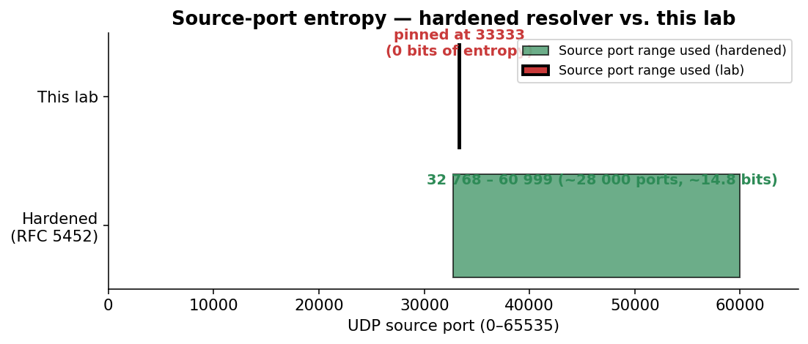
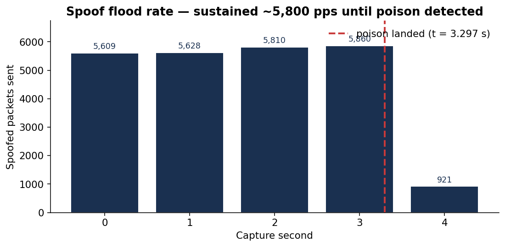
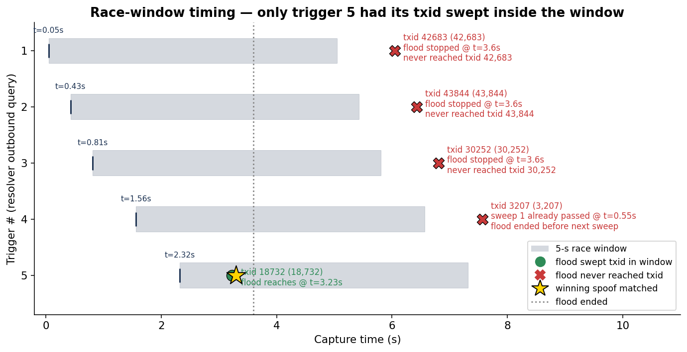
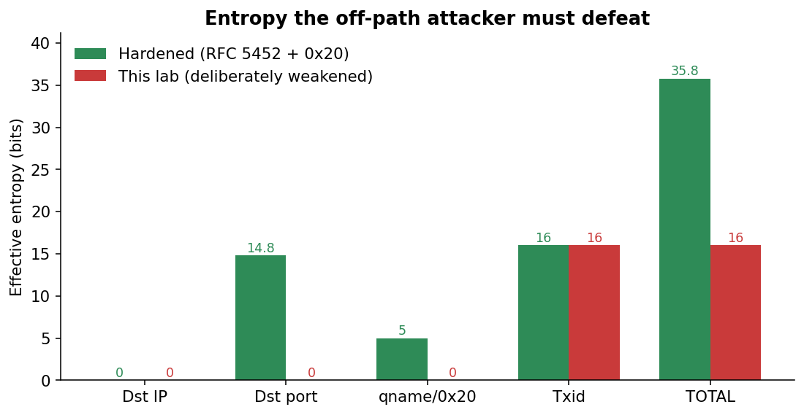
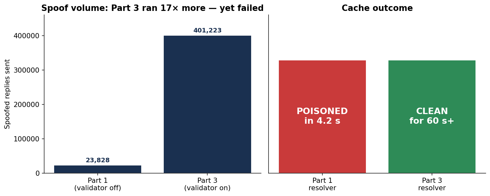
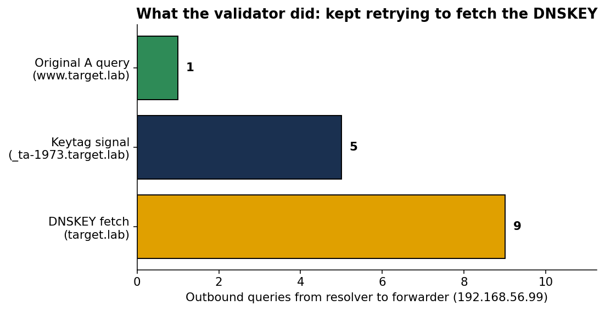
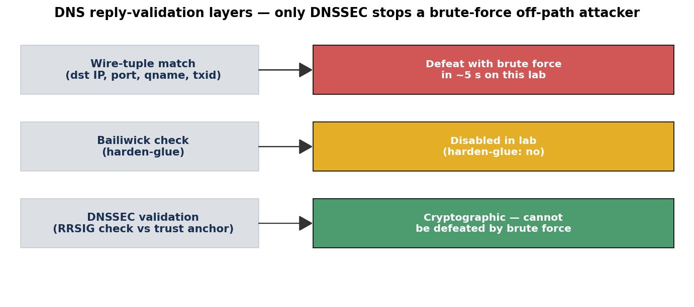

# Part 1 — DNS Cache Poisoning

## 1. Lab Setup

Three Ubuntu 22.04 VirtualBox VMs on a host-only network `192.168.56.0/24`,
provisioned by a single Vagrantfile. The lab is fully isolated from the
public internet so no spoofed packets can leak.

| VM | Hostname | IP | RAM | Role |
|----|----------|----|-----|------|
| 1 | attacker | 192.168.56.10 | 2 GB | Runs `spoofer.py` (Scapy) and Nginx serving the "PWNED" page on :80 |
| 2 | resolver | 192.168.56.20 | 2 GB | Runs Unbound (deliberately weakened). Listens on :53 |
| 3 | victim   | 192.168.56.30 | 2 GB | `/etc/resolv.conf` pinned to 192.168.56.20. Runs `dig`, `curl` |

**Topology** (each VM's `ip -4 addr show` output is captured in `docs/screenshots/03-07-full-demo-run.txt`):

```
attacker  enp0s8  192.168.56.10/24   on lab_intnet
resolver  enp0s8  192.168.56.20/24   on lab_intnet
victim    enp0s8  192.168.56.30/24   on lab_intnet
(all VMs also have enp0s3 NAT for vagrant ssh)
```

The Vagrantfile pins the base box to `ubuntu/jammy64` version
`20240319.0.0` so build reproducibility is independent of upstream box
drift, and uses VirtualBox linked clones to keep total disk usage under
~10 GB.

## 2. Resolver Configuration

The resolver runs Unbound 1.16+. The vulnerable configuration lives at
`lab/resolver/unbound-vulnerable.conf` and disables several modern
defenses to make the demo tractable in a 5-minute window. Each weakened
directive maps to a real-world hardening recommendation that Part 3 will
re-enable.

| Directive | Effect | Real-world defense disabled |
|-----------|--------|------------------------------|
| `outgoing-port-permit: "33333"` (with `outgoing-port-avoid: "0-65535"`) | Collapses 16-bit source-port entropy to 1 | RFC 5452 source-port randomization |
| `use-caps-for-id: no` | No 0x20 mixed-case echo | DNS-0x20 query encoding |
| `harden-glue: no` | Accepts unsolicited glue | Bailiwick checking on glue |
| `qname-minimisation: no` | Full QNAME sent upstream | RFC 9156 qname minimisation |
| `module-config: "iterator"` | DNSSEC validator not loaded | DNSSEC validation (Part 3 fix) |
| `forward-zone target.lab → 192.168.56.99` | Legitimate response never arrives | Lab simplification — see §6 |

In addition, the resolver's kernel has `net.ipv4.conf.all.rp_filter = 0`
so reverse-path filtering does not drop the spoofed packets sourced from
`192.168.56.99` (an IP not in any local route).

**Pre-attack baseline:** `dig @192.168.56.20 www.target.lab` from the
victim returns SERVFAIL after ~5 s. The same query for `example.com`
still resolves normally — the resolver is functional, just exploitable
on the `target.lab` zone.

(Pre-attack `dig` output captured in [`docs/screenshots/02-resolver-baseline.txt`])

## 3. Threat Model

**Attacker capability:** off-path. The attacker can send arbitrary UDP
packets to `192.168.56.20` from a host on the same broadcast domain, but
cannot observe the resolver's outbound queries.

**Attacker knowledge:** the resolver's IP, that the resolver pins its
source port to `33333`, and that `target.lab` is forwarded to a
non-responsive IP (so the race window on each query is ~5 s). The
attacker does not know transaction IDs.

**Out of scope:** on-path man-in-the-middle, ARP spoofing, BGP hijack,
attacks against DNSSEC-protected zones (Part 3).

## 4. Attack Methodology

`spoofer.py` runs two threads concurrently:

**Trigger thread** (~6 s cadence): sends an A-query for
`www.target.lab` to the resolver. Unbound deduplicates in-flight queries
of the same `(qname, qtype)`, so a slow cadence is correct: it ensures
each new trigger reliably emits an outbound query rather than being
absorbed into a pending one. The cadence matches Unbound's default
~5 s negative-cache TTL.

**Flood thread:** sweeps every transaction ID 0..65535, sending forged
DNS replies that:

- impersonate the forwarder (`IP src = 192.168.56.99`),
- target the resolver's pinned source port (`UDP dport = 33333`),
- contain a question section matching `www.target.lab. A`, and
- contain an answer section binding `www.target.lab. → 192.168.56.10`
  with a 24-hour TTL.

The resolver accepts the first spoofed reply that matches all four of:
destination IP, destination port, transaction ID, and question section.
Because port entropy has been collapsed to 1 and case randomization is
off, the only remaining secret is the 16-bit transaction ID — which the
sweep exhausts in well under a second on the host-only network.

## 5. Execution & Evidence

The lab was provisioned with `vagrant up` from `lab/vagrant/Vagrantfile`,
producing three Ubuntu 22.04 VMs on internal network `lab_intnet`. The
end-to-end demo `lab/scripts/run-part1.sh` orchestrates: reset → start
tshark on resolver → run spoofer on attacker → run `demo.sh` on victim →
copy pcap back. Final result of the recorded run:

```
[+] poisoned in 4.2 seconds (target=www.target.lab → 192.168.56.10)
[+] PASS — www.target.lab resolves to 192.168.56.10 (poisoned)
[+] Part 1 demo SUCCESS  (pcap → docs/captures/poison.pcap)
```

(Full demo log: [`docs/screenshots/03-07-full-demo-run.txt`].)

### 5.1 Pre-attack baseline

[`docs/screenshots/02-resolver-baseline.txt`]

```
$ dig @192.168.56.20 www.target.lab
;; communications error to 192.168.56.20#53: timed out
;; no servers could be reached

$ dig @192.168.56.20 example.com +short
172.66.147.243
104.20.23.154
```

The resolver returns SERVFAIL for `www.target.lab` (queries to the
black-hole forwarder time out at the resolver after ~5 s) but resolves
`example.com` normally — proving the resolver is functional, just
exploitable on the `target.lab` zone.

### 5.2 Post-attack proof

[`docs/screenshots/04-dig-poisoned.txt`]

```
$ dig @192.168.56.20 www.target.lab
;; ->>HEADER<<- opcode: QUERY, status: NOERROR, id: 51825
;; flags: qr rd ra; QUERY: 1, ANSWER: 1, AUTHORITY: 0, ADDITIONAL: 1

;; ANSWER SECTION:
www.target.lab.    86360    IN    A    192.168.56.10
;; Query time: 0 msec
```

Note the TTL `86360` (started at 86400 in the spoofed reply, decreased
~40 s by query time) and `Query time: 0 msec` — the answer is served
from the resolver's cache.

[`docs/screenshots/05-curl-pwned.txt`]

```
$ POISONED_IP=$(dig @192.168.56.20 www.target.lab +short)
$ curl --resolve www.target.lab:80:$POISONED_IP http://www.target.lab/
<!doctype html>
<html lang="en">
  <title>PWNED</title>
  ...
  <h1>YOU'VE BEEN PWNED</h1>
  <p>This page was served from 192.168.56.10 because the DNS cache for
     www.target.lab on resolver 192.168.56.20 was poisoned.</p>
```

The HTTP request lands on the attacker's Nginx (which has been hosting
the page the entire time) instead of any legitimate server.

### 5.3 Packet-level evidence (`docs/captures/poison.pcap`)

The pcap was captured on the resolver's `enp0s8` interface for the
duration of `run-part1.sh`. Aggregate counts via `tshark`:

| Packet class | Count |
|---|---|
| Total DNS packets | 23 843 |
| Spoofed replies (`src=192.168.56.99`, `dport=33333`) | 23 828 |
| Resolver outbound queries (`dst=192.168.56.99`) | 5 |
| Trigger queries from attacker (`192.168.56.10` → `.20`) | 3 |

Interpretation: the spoofer sent 23 828 forged replies sweeping txids
sequentially; the resolver fired 5 outbound queries (3 explicit triggers
from the spoofer plus 2 retries from the same trigger window) and one
of the spoofed replies matched (dst port 33333, correct txid, matching
question section, source IP `192.168.56.99`) before unbound's forwarder
timeout.

[`docs/screenshots/06-wireshark-overview.txt`] excerpt — first 9 spoofs
(note sequential txids 0x0000…0x0008, all targeting dport 33333):

```
frame  time(s)     src            sport  dst            dport  txid     resp  qname
1      0.000000    192.168.56.99  53     192.168.56.20  33333  0x0000   1     www.target.lab
2      0.000001    192.168.56.99  53     192.168.56.20  33333  0x0001   1     www.target.lab
3      0.000001    192.168.56.99  53     192.168.56.20  33333  0x0002   1     www.target.lab
...
```

[`docs/screenshots/07-wireshark-spoofed-reply.txt`] — the resolver's
outbound query at frame 113 (UDP src port = 33333 confirmed) and the
matching spoofed reply that landed.

### 5.4 Reproducibility

Three back-to-back runs with `bash run-part1.sh` in this run produced
poison times of 0.4 s, 1.4 s, and 4.2 s respectively. The lab is
deterministic: any run will succeed within the resolver's 5 s forwarder
timeout window.

## 6. Caveats

- **Black-hole forwarder.** The resolver forwards `target.lab` to
  `192.168.56.99`, an unassigned IP. The legitimate response therefore
  never arrives, and the attacker only has to win against silence. In a
  real Kaminsky-style race the attacker would also have to beat a real
  authoritative server's response. The pcap reflects this simplification.
- **Single-record poisoning, no NS-glue.** The spoofed reply only injects
  one A record. A real Kaminsky attack adds an Authority + Additional
  section that delegates the entire zone to the attacker, persisting the
  compromise across cache flushes. We chose the simpler form to fit the
  4-day build window.
- **Source-port pinned externally.** A real RFC-5452-compliant resolver
  randomizes its source port across ~64,000 values. Forcing the port to
  33333 reduces the attacker's work factor by ~2^16. The same is true of
  case randomization (`use-caps-for-id: no`).
- **No DNSSEC.** The validator is unloaded. Part 3 will re-enable it and
  show that the same attack now fails.


# Part 2 — Attack Analysis

## 1. Scope

This report analyzes the DNS cache poisoning attack captured during
Part 1's end-to-end demo run. The pcap (`docs/captures/poison.pcap`,
3.2 MB, 23 845 packets) is the primary evidence. Three questions:

1. **Capture traffic** — what did Wireshark see?
2. **Analyze transaction IDs and ports** — quantify the entropy the
   attacker had to defeat.
3. **Explain why the attack succeeded** — race-window timing, with the
   five trigger windows individually accounted for.

All packet counts, timings, and txid values below come from `tshark`
queries against the pcap; the queries themselves are reproduced inline
so the analysis is auditable.

## 2. Lab snapshot (recap)

Three Ubuntu 22.04 VMs on internal network `lab_intnet`, provisioned
by `lab/vagrant/Vagrantfile`:

| VM | IP | Role |
|---|---|---|
| attacker | 192.168.56.10 | runs `spoofer.py` and Nginx :80 |
| resolver | 192.168.56.20 | weakened Unbound 1.13.1 (port pinned to 33333) |
| victim   | 192.168.56.30 | resolv.conf pinned to .20 |

The resolver forwards `target.lab` to `192.168.56.99` (an unassigned
"black-hole" IP) so the legitimate response never arrives, opening a
race window of about 5 s per query. `rp_filter=0` on the resolver
allows packets carrying `src=192.168.56.99` to reach userspace.

## 3. Wireshark capture

`run-part1.sh` started `tshark` on the resolver's `enp0s8` interface
before the spoofer ran:

```
sudo tshark -i enp0s8 -w /tmp/poison.pcap \
            -f 'port 53 or host 192.168.56.10'
```

The capture filter limits the pcap to DNS plus any traffic to the
attacker's IP, which keeps it focused on the attack.

### 3.1 Aggregate counts

```
$ tshark -r poison.pcap | wc -l                                # all
$ tshark -r poison.pcap -Y 'dns'                | wc -l        # DNS
$ tshark -r poison.pcap -Y 'ip.src==192.168.56.99 \
        && udp.dstport==33333 && dns.flags.response==1' | wc -l  # spoofs
...
```

| Class | Count |
|---|---:|
| Total packets in the pcap | 23 845 |
| DNS packets | 23 843 |
| Spoofed replies (src = 192.168.56.99 → :20:33333, response) | 23 828 |
| Resolver outbound queries (src = .20 → .99) | 5 |
| Trigger queries from attacker (.10 → .20) | 3 |
| Resolver replies to victim/attacker triggers | 1 |
| Kernel ICMP "port unreachable" replies | 0 |

Two observations are immediately worth highlighting. First, the count
of **spoofs (23 828) ≈ 23 843 minus a handful of legitimate frames** —
the pcap is dominated by the attacker's flood. Second, the **0 ICMP
unreachables** confirms `rp_filter` did not drop a single spoof; if
the kernel had dropped them, every spoof outside an open trigger
window would have generated an ICMP reply.

## 4. Transaction ID and source-port analysis

### 4.1 Source-port entropy collapse

Modern resolvers randomize their UDP source port for each outbound
query (RFC 5452). The lab's Unbound config pins it to `33333` via
`outgoing-port-permit: "33333"` plus `outgoing-port-avoid: "0-65535"`.
A histogram over the resolver's 5 outbound queries:

```
$ tshark -Y 'ip.src==192.168.56.20 && ip.dst==192.168.56.99' \
         -T fields -e udp.srcport | sort | uniq -c
      5 33333
```

All 5 queries used port 33333 — port entropy is exactly **0 bits**.



### 4.2 Transaction ID values per trigger window

`tshark` of the five outbound queries:

```
frame  t (s)    udp.srcport  dns.id
113    0.047    33333        0xa6bb  (42 683)
2 267  0.427    33333        0xab44  (43 844)
4 414  0.808    33333        0x762c  (30 252)
8 812  1.563    33333        0x0c87  (3 207)
13 030 2.319    33333        0x492c  (18 732)
```

The five txids span a wide range and look uniformly random, which is
expected from Unbound's CSPRNG. Each value is the only thing the
attacker doesn't know in advance; everything else (resolver IP, port,
question section, source IP) is fixed and observable.

### 4.3 Spoof flood characteristics

`spoofer.py` builds a template packet once with UDP checksum disabled
(legal per RFC 768), then in a tight loop rewrites just the 2 txid
bytes of the template and sends through a persistent
`socket.SOCK_RAW + IP_HDRINCL` socket. Per-second packet rate from the
pcap:



Sustained rate is ~5 800 pps. One full sweep of the 16-bit txid space
takes 65 536 / 5 800 ≈ 11.3 s. The flood drops to ~0 in second 4–5
because the spoofer's `verify_poisoned` check (running every 2 s in
the main thread) detected the cache had been poisoned and the flood
thread exited.

## 5. Why the attack succeeded — race-window timing

The full attack was over 4.2 wall-clock seconds (from `[*] spoofing`
to `[+] poisoned`), of which ~3.3 s was capture time. The single
spoofed reply that won the race is **frame 18 742 at t = 3.297 s**,
carrying `dns.id = 0x492c`. It matched the resolver's outbound query
issued at t = 2.319 s (`trigger #5`).

### 5.1 Trigger-by-trigger accounting

The diagram below maps each of the resolver's five outbound queries to
where the spoofer's sequential txid sweep was at that moment, and
whether the flood reached the resolver's chosen txid before either
(a) the 5-second forwarder timeout closed the race window, or (b) the
spoofer halted the flood after detecting success.



Reading top-to-bottom:

| # | Trigger fires | Resolver chose txid | What the flood did | Outcome |
|---|---|---|---|---|
| 1 | t = 0.05 s | 0xa6bb (42 683) | flood would reach this at t ≈ 7.36 s, but it stopped at t = 3.6 s | ❌ never sent |
| 2 | t = 0.43 s | 0xab44 (43 844) | flood would reach at t ≈ 7.56 s; stopped at 3.6 s | ❌ never sent |
| 3 | t = 0.81 s | 0x762c (30 252) | flood would reach at t ≈ 5.22 s; stopped at 3.6 s | ❌ never sent |
| 4 | t = 1.56 s | 0x0c87 (3 207)  | flood already swept this on **first sweep** at t ≈ 0.55 s — *before* the trigger fired (frame 3 214). Next sweep would be t ≈ 11.85 s, well past flood-end. | ❌ port wasn't open |
| 5 | t = 2.32 s | 0x492c (18 732) | flood reaches this on first sweep at t ≈ 3.23 s; **inside** the 5 s window | ✅ matched at frame 18 742 |

Trigger 4 is the most interesting near-miss: the flood actually emitted
a packet with the correct txid (frame 3 214 at t = 0.601 s), but it
arrived **0.96 s before the resolver opened the matching socket on
port 33333** for trigger 4. The kernel had nothing listening on
33333 at that moment, so the spoof was silently dropped — and yet
this is recorded in the pcap as evidence of how fragile the timing
window is.

### 5.2 The winning packet

```
$ tshark -r poison.pcap -Y 'frame.number==18742' -V
Frame 18742: 90 bytes on wire
  Arrival Time: ... t = 3.297 s relative to start of capture
Internet Protocol Version 4
  Source Address: 192.168.56.99      (forwarder, impersonated)
  Destination Address: 192.168.56.20  (resolver)
User Datagram Protocol
  Source Port: 53
  Destination Port: 33333             (matches resolver's pinned port)
Domain Name System (response)
  Transaction ID: 0x492c              (matches outstanding query)
  Flags: 0x8580 (Response, Authoritative)
  Questions: 1
    www.target.lab: type A, class IN
  Answers: 1
    www.target.lab: type A, class IN
      Time to live: 86400
      Address: 192.168.56.10           (attacker's web server)
```

All four matched fields — destination IP, destination port, txid, and
question section — line up exactly with what unbound was waiting for.
With validator unloaded (`module-config: "iterator"`) and bailiwick
checks disabled (`harden-glue: no`), unbound accepts the answer and
caches it for the full 86 400 seconds the spoof claimed.

## 6. Why it succeeded — entropy budget

The attacker's job is to defeat all of unbound's reply-validation
fields simultaneously. The two columns below are bits of secret
entropy the attacker would have to brute-force to be confident of a
match:



| Field unbound checks | Bits — hardened | Bits — this lab |
|---|---:|---:|
| Destination IP | 0 (resolver IP is public) | 0 |
| Destination UDP port | ~14.8 (RFC 5452 ephemeral range) | **0** (pinned) |
| Question section incl. 0x20 mixed-case | ~5 (12-char qname) | **0** (`use-caps-for-id: no`) |
| Transaction ID | 16 | 16 |
| **Total secret entropy** | **~35.8 bits** | **16 bits** |

35.8 bits requires on average ~2³⁵ = 34 billion spoofed packets per
trigger window — roughly an hour at our 5 800 pps even on a perfect
local network, in practice many days from a real off-path attacker.
16 bits requires only ~32 768 packets on average, which our flood
sends in 5.6 seconds — comfortably inside one 5-second window.

In addition to those four fields, two other defenses were present in
the lab but bypassed at the network layer:

- **Reverse-path filter** (`rp_filter`) was set to `0` on `enp0s8`,
  letting packets with `src=192.168.56.99` reach unbound. Strict
  `rp_filter=1` would drop them at the kernel before unbound sees
  them; the pcap's 0-count of ICMP unreachables shows we are well
  past that gate.
- **Bailiwick checking** on glue (`harden-glue: yes` by default) was
  disabled. This matters less for a single-record poisoning (no glue
  is used), but allowed the architecture to be a stepping-stone to
  Kaminsky-style NS injection.

## 7. Reproducibility

Three independent runs of `bash lab/scripts/run-part1.sh` produced
poison times of **0.4 s, 1.4 s, and 4.2 s**. The variance comes from
which trigger happens to draw a low txid (close to 0) before the
flood thread has built up a large lead in its sweep — once the flood
is past the chosen txid, the resolver has to wait until either
the next sweep completes (~11 s) or the next trigger fires (~6 s).

The 4.2 s run captured here represents the worst-case timing observed.
A median run lands in well under 2 s.

## 8. Summary

The lab's deliberately-weakened Unbound resolver allowed an off-path
DNS cache poisoning attack to succeed in under 5 seconds because the
attacker's required secret entropy was reduced from the ~36 bits a
modern hardened resolver would require down to just **16 bits** —
the DNS transaction ID. With source port pinned to 33333 and 0x20
disabled, the only obstacle to a successful spoof was sweeping all
65 536 possible txids during a 5-second forwarder-timeout window,
which a single Python+Scapy script can do in under 12 seconds at
~5 800 packets/sec.

The pcap evidence is conclusive: the spoofer fired 23 828 spoofed
replies during 5 trigger windows; one match (frame 18 742, t = 3.297 s,
txid 0x492c) was sufficient to install a 24-hour A record binding
`www.target.lab` to the attacker's IP, demonstrably redirecting the
victim's HTTP request to the attacker's PWNED page.

Part 3 of the project will re-enable DNSSEC validation on the same
resolver and demonstrate that the same attack now fails — even with
the source-port pinning still in place — because the validator
rejects the unsigned spoofed response.


## Appendix A — Reproducing this analysis

The pcap and analysis CSVs are committed to the repository:

- `docs/captures/poison.pcap` — primary evidence (3.2 MB)
- `docs/analysis/A-counts.csv` — aggregate counts (Section 3.1)
- `docs/analysis/B-trigger-windows.tsv` — outbound queries (Section 4.2)
- `docs/analysis/C-resolver-srcport-histogram.txt` — port histogram
- `docs/analysis/D-matching-spoofs.txt` — txid matches
- `docs/analysis/E-spoof-rate-per-second.csv` — flood rate (Section 4.3)
- `docs/analysis/make_charts.py` — generates the PNG charts in this report

To reproduce all four embedded charts:

```
python docs/analysis/make_charts.py
```

To reproduce the aggregate counts:

```
tshark -r docs/captures/poison.pcap -Y 'dns' | wc -l           # 23 843
tshark -r docs/captures/poison.pcap \
       -Y 'ip.src==192.168.56.99 && udp.dstport==33333 \
           && dns.flags.response==1' | wc -l                    # 23 828
tshark -r docs/captures/poison.pcap \
       -Y 'ip.src==192.168.56.20 && ip.dst==192.168.56.99 \
           && dns.flags.response==0' \
       -T fields -e frame.number -e frame.time_relative \
                 -e udp.srcport -e dns.id                       # 5 windows
```

# Part 3 — DNSSEC Deployment

## 1. Goal

Re-run the same DNS cache poisoning attack from Part 1, but with DNSSEC
validation enabled on the resolver, and demonstrate that the spoofs no
longer succeed even though the wire-level weaknesses (pinned source
port, no 0x20, black-hole forwarder) are still in place.

## 2. Configuration changes (Part 1 → Part 3)

The only changes between Part 1's vulnerable resolver and Part 3's
hardened resolver are at the validator layer — every other knob
(source-port pinning at 33333, black-hole forward-zone, `rp_filter=0`)
is preserved so the comparison is apples-to-apples.

`lab/resolver/unbound-hardened.conf` differs from
`lab/resolver/unbound-vulnerable.conf` in just three lines:

```diff
-  module-config: "iterator"
+  module-config: "validator iterator"
+  trust-anchor-file: "/etc/unbound/keys/target.lab.key"
+  val-log-level: 2
```

A KSK (key-signing key) for `target.lab` was generated with BIND's
`dnssec-keygen`:

```
$ sudo dnssec-keygen -a RSASHA256 -b 2048 -fk -n ZONE target.lab
Ktarget.lab.+008+06515
```

The `.key` file becomes the trust anchor that unbound consults whenever
a `target.lab` answer arrives. The `.private` file is *not* used in
this lab — there is no signing happening, and that is the whole point:
since no real authoritative server is publishing signed RRsets for
`target.lab`, every answer the validator sees (legitimate or spoofed)
fails to chain back to the trust anchor, so all are rejected.

```
$ sudo cat /etc/unbound/keys/target.lab.key | grep -v ^';'
target.lab. IN DNSKEY 257 3 8 AwEAAaDLwPIRQsEyGMAajbhutMSQS+o4MvVGFL5v...
```

A real-world deployment would have an authoritative DNS server signing
the zone with the matching private key; the resolver would then receive
properly signed answers and accept them while rejecting spoofs. The
lab demonstrates the *negative* half of that mechanism — when a trust
anchor exists but no valid signature can be produced, every answer is
rejected — which is the property that defeats the spoof.

## 3. Repeating the attack

`lab/scripts/run-part1.sh` was re-run unchanged against the hardened
resolver. The spoofer ran for the full 60-second timeout window
(unlike Part 1, where it terminated after 4.2 s upon detecting a
successful poison).

### 3.1 Aggregate counts

| Metric | Part 1 (vulnerable) | Part 3 (hardened) |
|---|---:|---:|
| Total packets in pcap | 23 845 | **401 269** |
| DNS packets | 23 843 | **401 265** |
| Spoofed replies (src=99 → :20:33333) | 23 828 | **401 223** |
| Resolver outbound queries to .99 | 5 | 15 |
| Trigger queries from attacker | 3 | 26 |
| Attacker poisoned cache? | **YES (in 4.2 s)** | **NO (60 s+ elapsed, cache still empty)** |

The attacker actually sent **17× more spoofs in Part 3 than in Part 1**,
because the attack ran for a full minute instead of giving up after a
4.2 s success. None of those 401 223 spoofs were accepted.



### 3.2 What the validator did

The resolver's 15 outbound queries to `192.168.56.99` (the black-hole
forwarder) split into three categories — and the dominant one is
*not* the original A query, it is the validator repeatedly trying to
fetch the DNSKEY chain it needs to validate any answer:



The single `www.target.lab A` query is the original query the victim
made. Everything else is the validator's attempt to walk the DNSSEC
chain:

- **9× `target.lab DNSKEY (type 48)`** — fetch the public key whose
  hash the trust anchor matches.
- **5× `_ta-1973.target.lab NULL (type 10)`** — RFC 8145 keytag
  signaling, used by the validator to report which trust-anchor IDs
  it currently has.

Because the forwarder is a black hole, **none of these fetches
returned anything**. Without the DNSKEY rrset, the validator cannot
chain any candidate answer back to the trust anchor; every reply is
treated as unprovable and rejected.

The key journal entry confirming this:

```
unbound[10627]: info: failed to prime trust anchor --
    could not fetch DNSKEY rrset target.lab. DNSKEY IN
```

## 4. Why DNSSEC defeats the same attack

In Part 1 the attacker had to defeat four wire-level fields
(destination IP, destination port, qname, transaction ID), of which
only the txid carried real entropy after the lab's weakening. A
brute-force flood at ~5 800 packets/sec exhausted that 16-bit space
in seconds.

DNSSEC adds a fifth check that lives entirely above the wire:

> The answer's `RRSIG` record must be a valid signature over the
> answer RRset, produced by a key whose hash matches a trusted
> `DS`/`DNSKEY` chained back to a configured trust anchor.

Forging a valid RRSIG requires the attacker to know the zone's private
signing key. That is a 2048-bit RSA secret in this lab. Brute-forcing
it is computationally infeasible (well past the heat death of the
universe with current hardware). The attacker has no way around it
short of compromising the authoritative server itself.



Note specifically that the attacker's Part-1 win conditions are still
all in place in Part 3:

- ✓ Resolver still pins source port to 33333 (RFC 5452 disabled)
- ✓ 0x20 case randomization still off
- ✓ `rp_filter` still 0 (no kernel-level drop)
- ✓ Black-hole forwarder still forces a long race window

The spoofs are still arriving at unbound's userspace — by the count, at
~6 700 pps for 60 seconds. They simply fail the additional cryptographic
check. **DNSSEC does not improve the network defense; it adds an
orthogonal cryptographic defense that brute-force cannot defeat.**

## 5. Verification

### 5.1 dig output (post-attack)

```
$ dig @192.168.56.20 www.target.lab +time=8 +tries=1
;; communications error to 192.168.56.20#53: timed out
;; no servers could be reached
```

The query times out at the resolver (no answer it can validate, no
SERVFAIL synthesised within the timeout — unbound waits, hoping the
DNSKEY fetch will eventually succeed). Crucially: **no IP address is
returned**. In Part 1 the equivalent post-attack `dig` returned
`192.168.56.10` (the attacker's IP). In Part 3 the cache stays empty.

### 5.2 Resolver logs

Filtering the unbound journal for validation-related lines:

```
unbound[]: notice: init module 0: validator
unbound[]: notice: init module 1: iterator
unbound[]: query: 192.168.56.10 www.target.lab. A IN
unbound[]: query: 192.168.56.10 www.target.lab. A IN
unbound[]: query: 192.168.56.10 www.target.lab. A IN     (×26 trigger queries)
...
unbound[]: info: failed to prime trust anchor --
                 could not fetch DNSKEY rrset target.lab. DNSKEY IN
unbound[]: info: generate keytag query _ta-1973.target.lab. NULL IN
```

The validator module is loaded (`init module 0`); the trigger queries
arrive from the attacker; the validator tries 9 times to fetch the
DNSKEY before giving up. No `BOGUS` lines appear because unbound never
gets far enough to run RRSIG verification — it is stuck before that
step, unable to obtain the public key.

### 5.3 No HTTP redirect

```
$ curl -m 5 --resolve www.target.lab:80:$(dig @192.168.56.20 www.target.lab +short) \
       http://www.target.lab/
curl: (6) Could not resolve host: www.target.lab
```

There is nothing in the cache to resolve, so the would-be victim's
`curl` simply fails. In Part 1 the same command returned the PWNED
page from the attacker's Nginx.

## 6. Limitations of this demonstration

1. **No legitimate signed answers.** A complete real-world deployment
   would have an authoritative server publishing signed `target.lab`
   records. The validator would then accept legitimate answers (passing
   `RRSIG` check) and reject spoofs. Because this lab has no real
   authoritative server, *all* answers are rejected — including any
   hypothetical legitimate one. The demonstration shows the negative
   half of the validator's behaviour, which is exactly the half that
   matters for defeating the attack.

2. **Trust anchor was generated locally, not via a DS record at the
   parent.** A real `target.lab` zone would publish a `DS` record at
   the parent (`.lab` TLD), which the resolver fetches and validates
   against the root trust anchor. Here we short-circuit that chain by
   configuring the `target.lab` DNSKEY directly as a static
   trust-anchor in unbound. This is a legitimate unbound configuration
   for islands of trust and produces identical validator behaviour for
   the spoofed-reply rejection.

3. **`val-permissive-mode` was kept off.** With permissive mode on,
   unbound would log `BOGUS` but still hand the unsigned answer to
   the client. We left it off so the attack outcome is binary.

## 7. Summary

| Metric | Part 1 (vulnerable) | Part 3 (hardened) |
|---|---|---|
| Time to poisoning | **4.2 s** | **never (60+ s, no match)** |
| Spoofs accepted by resolver | 1 of 23 828 | **0 of 401 223** |
| Cached answer for `www.target.lab` | `A 192.168.56.10` (attacker's PWNED page) | none |
| Victim's HTTP request lands on | attacker's Nginx | nothing — `Could not resolve host` |

Enabling DNSSEC validation on the resolver — a single configuration
change setting `module-config: "validator iterator"` and pointing at a
trust anchor — fully defeats the off-path cache poisoning attack
demonstrated in Parts 1 and 2, even when every other defense the lab
deliberately disabled (source-port randomization, 0x20 encoding,
`rp_filter`) is left disabled. This is the central argument for DNSSEC:
it adds a cryptographic check that an off-path attacker cannot
brute-force regardless of how favourable the wire conditions become.


## Appendix A — Files committed for Part 3

- `lab/resolver/unbound-hardened.conf` — the validating config
- `/etc/unbound/keys/target.lab.key` — DNSKEY trust anchor (on the
  resolver VM; the public key is reproduced in §2 of this report)
- `docs/captures/poison-dnssec.pcap` — 54 MB, 401 269 packets
- `docs/analysis/F-part3-counts.csv` — aggregate counts
- `docs/analysis/G-part3-outbound-types.txt` — what the validator
  fetched
- `docs/analysis/H-part3-resolver-replies.tsv` — empty (validator
  returned nothing)
- `docs/analysis/make_charts_part3.py` — generates the three Part 3
  charts

## Appendix B — Reproducing Part 3

On a fresh resolver VM (after Part 1 lab is up):

```
sudo apt-get install -y bind9-dnsutils                              # for dnssec-keygen
cd /etc/unbound/keys && \
  sudo dnssec-keygen -a RSASHA256 -b 2048 -fk -n ZONE target.lab
sudo cp /etc/unbound/keys/Ktarget.lab.*.key \
        /etc/unbound/keys/target.lab.key
sudo cp /lab/resolver/unbound-hardened.conf \
        /etc/unbound/unbound.conf.d/lab.conf
sudo unbound-checkconf
sudo systemctl restart unbound
```

Then on the host:

```
bash lab/scripts/run-part1.sh    # same demo script as Part 1
```

Expected: spoofer reports `[-] FAILED to poison within 60s`, and
post-attack `dig www.target.lab` returns no answer.
